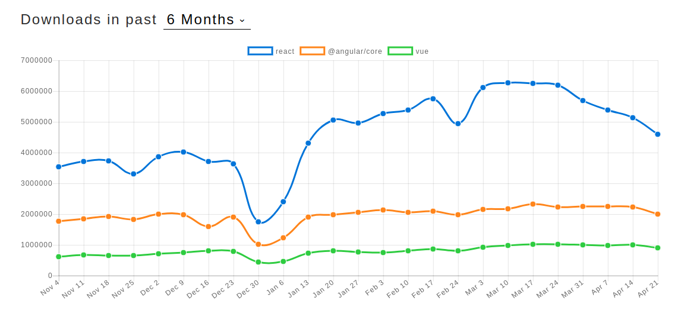

# Workshop de Introdução ao React

React é uma biblioteca ECMAScript de código aberto para o desenvolvimento de interfaces de usuário. É mantida pelo Facebook e Instagram.

> React permite a criação de SPAs (Single-page Applications), que são aplicações que a interação do usuário não necessita que a página seja regarregada no navegador.


## Por que React?

A imagem a seguir mostra a quantidade de downloads do React no NPM nos últimos seis meses: 



React possui um grande ecossistema de pacotes que auxiliam muito o desenvolvimento de aplicações. Além disso está em constante desenvolvimento pelo Facebook.

## Primeiros passos

Verificar se o `node` está instalado:
```bash
$ node -v
```

Caso o `node` não esteja instalado. Instale por meio do [NVM](https://github.com/nvm-sh/nvm) (é necessário instalar o NVM também):

```bash
$ nvm install 10
```

Para esse workshop iremos utilizar uma ferramenta de *scaffolding* chamada [React Creat App](https://facebook.github.io/create-react-app/docs/getting-started).

> Usar uma ferramenta de *scaffolding* evita o trabalho de configurar todo o ambiente de desenvolvimento com o Webpack e Babel, mas não é o recomendado para uma aplicação em produção.

[Agora iremos criar a nossa primeira aplicação usando React](./lista-tarefas)