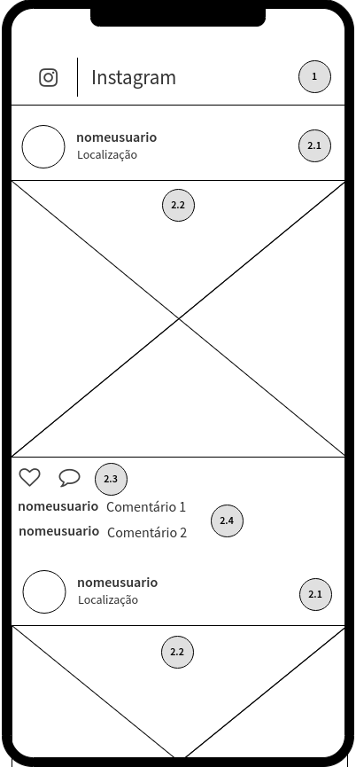

# Criando uma cópia do Instagram com React

Limpe o código do arquivo `TelaInicial.js` para ficar assim:

```jsx
import React from 'react';

class TelaInicial extends React.Component {
  render() {
    return (
      <div>
        Meu Instagram
      </div>
    );
  }
}

export default TelaInicial;
```

O objetivo desse exercício é fazer uma cópia **simplicada** do Instagram. Uma versão funcional pode ser acessada [aqui](www.google.com).

A aplicação web será *mobile-first*, ou seja, terá sua experiência de uso centrada em dispositivos mobile.

> Não iremos nos preocupar com o *layout* para desktop, a fim de simplificar ainda mais a aplicação.

## Definindo os Componentes

Antes de começar a criar o código fonte, vamos de definir os componentes que irão compor a aplicação: O *wireframe* a seguir dá uma ideia clara de quais componentes podemos separar a aplicação:



Podemos definir os seguintes componentes:

 1. Cabeçalho
 1. Lista de Posts
    1. Cabeçalho (nome do usuário e localização)
    1. Imagem
    1. Ações (curtir e comentar)
    1. Comentrários (nome do usuário e comentário)

[Criando o cabeçalho](./passo-1)