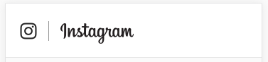

## Criando o Cabeçalho

Crie um novo arquivo chamado `Cabecalho.js` na pasta de componentes. Ele será um componente que não precisa manter estado, chamado de *stateless*.

```jsx
import React from 'react';

const Cabecalho = () => {
  return (
    <nav>Instagram</nav>
  );
};

export default Cabecalho;
```

> Existem várias formas de se declarar um componente com React. Até agora tinhamos usado uma classe. Porém componentes sem estado não precisam usar uma classe, podendo ser declarados apenas como uma função.

Agora vamos estilizar o cabeçalho para que ele ficar semelhante ao do Instagram.



## Estilos no React

No React é possível estilizar um componente sem precisar de um arquivo `css`. 

```jsx
const styles = {
  estilo1: {
    color: 'blue'
  },
  estilo2: {
    color: 'red',
    fontSize: 24
  },
  estilo3: {
    backgroundColor: 'green'
  },
};

const Componente = () => {
  return (
    <div>
      <div style={styles.estilo1}>Texto 1</div>
      <div style={styles.estilo2}>Texto 2</div>
      <div style={styles.estilo3}>Texto 3</div>
    </div>
  );
};
```
> Note que o atributo CSS `font-size` vira `fontSize` já que não é permitido hífens como chaves de propriedades em um JSON.

## Dicas para o Estilizar o Cabeçalho

### Icones

O cabeçalho possui um ícone referente à logo do Instagram. Tomando proveito do grande ecossistema de pacotes para React, podemos utilizar o Font Awesome para facilitar o desenvolvimento. Para instalar os ícones no projeto:

```bash
$ npm i --save @fortawesome/fontawesome-svg-core
$ npm i --save @fortawesome/free-solid-svg-icons
$ npm i --save @fortawesome/react-fontawesome
$ npm i --save @fortawesome/free-brands-svg-icons
$ npm i --save @fortawesome/free-regular-svg-icons
```

Para usar no componente, importe:

```jsx
import { FontAwesomeIcon } from '@fortawesome/react-fontawesome';
import { faInstagram } from '@fortawesome/free-brands-svg-icons';
```

E declare onde quiser o ícone:

```jsx
<FontAwesomeIcon icon={faInstagram} />
```
### Fonte da Logo

Caso queira usar uma fonte mais fiel a da logo. Você pode adicionar a seguinte fonte dentro da tag `<head>` no arquivo `/public/index.html`:

```html
<link href="https://fonts.googleapis.com/css?family=Lobster+Two" rel="stylesheet">
```
E aplicar ao texto:

```jsx
const styles = {
  textoLogo: {
    fontFamily: "'Lobster Two', cursive"
  }
};

<div style={styles.textoLogo}>Instagram</div>
```

[Prosseguir para a próxima parte](../passo-2)