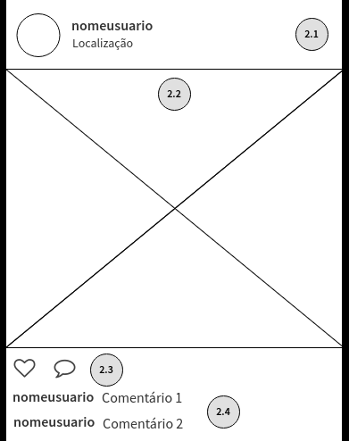

## Criando a Lista de Posts

### Passo anterior

O código do cabeçalho estilizado pode ficar parecido com:

```jsx
import React from 'react';
import { FontAwesomeIcon } from '@fortawesome/react-fontawesome';
import { faInstagram } from '@fortawesome/free-brands-svg-icons';

const styles = {
  nav: {
    display: 'flex',
    flexDirection: 'row',
    padding: '23px 20px',
    borderBottom: '1px solid lightgray'
  },
  divIcone: {
    paddingRight: 16,
    borderRight: '1px solid gray',
    fontSize: 24
  },
  titulo: {
    paddingLeft: 16,
    fontSize: 24,
    fontFamily: "'Lobster Two', cursive"
  }
};

const Cabecalho = (props) => {
  return (
    <nav style={styles.nav}>
      <div style={styles.divIcone}>
        <FontAwesomeIcon icon={faInstagram} />
      </div>
      <div style={styles.titulo}>Instagram</div>
    </nav>
  );
};

export default Cabecalho;
```

### Usando mocks

Agora adicione faça o download da pasta `mocks` desse repositório e a adicione ao seu projeto. Ela contem um arquivo com um JSON contendo vários posts, que ajudará no desenvolvimento da lista de posts.

O conteúdo de um post está definido da seguinte forma:

```js
const POSTS = [{
  nomeUsuario: string,
  localizacao: string,
  contagemLikes: number,
  postUrl: string,
  thumbUrl: string,
  comentarios: [
    { nomeUsuario: string, textoComentario: string },
    ...
  ]
}, ...]
```

O seu arquivo `TelaInicial.js` deve estar parecido com:

```jsx
class TelaInicial extends React.Component {
  render() {
    return (
      <main>
        <Cabecalho />
      </main>
    );
  }
}
```

Agora vamos criar um novo componente chamado `ListaPosts.js` e um componente `Post.js`:

```jsx
import React from 'react';
import { POSTS } from '../mocks/posts.mock';

class ListaPosts extends React.Component {
  render() {
    return (
      <article>
        {POSTS.map(post => <Post post={post} />)}
      </article>
    );
  }
}

export default ListaPosts;
```

```jsx
const Post = ({ post }) => {
  return (
    <div>
      ...
    </div>
  );
}
```

O wireframe de um post contém os seguintes elementos:



Dessa forma, conseguimos já imaginar como será a divisão em componentes de um post:

```jsx
const Post = ({ post }) => {
  const possuiComentarios = Boolean(post.comentarios &&
    post.comentarios.length > 0);
  return (
    <div style={styles.post}>
      <CabecalhoPost
        thumbUrl={post.thumbUrl}
        nomeUsuario={post.nomeUsuario}
        localizacao={post.localizacao}
      />
      <ImagemPost postUrl={post.postUrl} />
      <AcoesPost />
      <ContagemCurtidas contagemLikes={post.contagemLikes} />
      {possuiComentarios &&
        <Comentarios comentarios={post.comentarios} />}
    </div>
  )
}
```